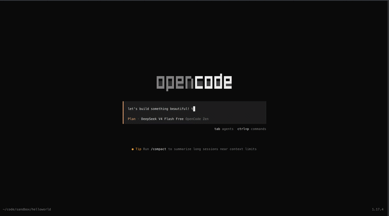

# opensnake 🐍

> The agent is thinking. You're doomscrolling. There's a better way.

[](https://go.hugobatista.com/gh/hugobatista/opensnake/releases)
[](https://go.hugobatista.com/gh/hugobatista/opensnake/actions/workflows/lint.yml)
[](https://go.hugobatista.com/gh/hugobatista/opensnake/actions/workflows/test.yml)
[](https://pypi.org/project/opensnake)
[](https://opensource.org/licenses/MIT)
[](https://docs.renovatebot.com)




Agentic coding is magical. You describe what you want and the model explores, reasons, and returns with a solution that makes you wonder why you even have a keyboard.

Then the status bar says **Thinking...** and time grinds to a halt.

Suddenly you're three pages deep into a subreddit you don't care about. Twitter, again. An issue thread from 2019 about a bug in a framework you've never used. Anything to fill the forty seconds of silence while tokens appear one... by... one.

**opensnake** replaces that sad ritual with snake. Classic, shameless, deeply satisfying snake. It floats as a transparent overlay right over your editor — no alt-tab, no context switch, just arrow keys and a reptile with an eating disorder.

When the model starts thinking, the game opens. When it finishes, the game vanishes. You score points by eating the OPENCODE block letters scattered across the screen. Yes, you are literally consuming the name of the very thing you're waiting on. Cathartic or ironic? Your call.

*opensnake is an independent project, not affiliated with or endorsed by the opencode team. We just like the tool and hate waiting.*

---

## Gameplay

| You are | A snake |
|---|---|
| You eat | Big blocky OPENCODE letters |
| Worth | 100 points and +3 length each |
| Letters spawn | 10 at start, then 1 every 3 seconds (up to 100) |
| Controls | Arrow keys to move, ESC to quit (or just lose, that works too) |
| Window | Transparent overlay. Your coworkers will never know. |

---

## Installation

```bash
pip install opensnake
# or for the cool kids
uv tool install opensnake
# or from source if you enjoy build scripts
git clone https://github.com/hugobatista/opensnake
cd opensnake
uv sync
```

Then hook it in (one command, we promise):

```bash
opensnake install
```

Restart opencode. That's it. The daemon auto-starts — you never have to think about it. Which is fitting. The whole point is to think less.

---

## Usage

```bash
opensnake once             # Quick game, no daemon. Just admit you want to play.
opensnake daemon           # Manual start (the plugin handles this normally)
opensnake status           # Everything nominal? Probably.
opensnake install          # Wire it into opencode
opensnake uninstall        # Why would you though
opensnake config           # Peek at or regenerate your config
```

### Fancy mode

```bash
opensnake once --opacity 0.95 --tick-ms 50 --letter-count 200
# translation: "I want to die faster and in darker mode"
```

---

## Configuration

`~/.config/opensnake/config.json` — your joy, your parameters:

```json
{
  "opacity": 0.8,
  "tick_ms": 80,
  "cell_size": 32,
  "letter_count": 100,
  "initial_letters": 10,
  "spawn_interval_ms": 3000,
  "gray_map": {
    "O": [180, 220],
    "P": [160, 200],
    "E": [200, 240],
    "N": [140, 180],
    "C": [210, 250],
    "D": [170, 210]
  }
}
```

| Field | Default | What it controls |
|---|---|---|
| `opacity` | 0.8 | Window transparency. 1.0 = "I forgot I'm at work." |
| `tick_ms` | 80 | Snake speed. Lower = faster = hubris. |
| `cell_size` | 32 | Grid cell size in pixels. Bigger = easier = boring. |
| `letter_count` | 100 | Max letters on screen. The GPU can handle it. Can you? |
| `initial_letters` | 10 | Letters at start. The calm. |
| `spawn_interval_ms` | 3000 | New letter every N ms. The storm. |
| `gray_map` | per letter | Fill/border colors. For people who care about aesthetics. |

---

## Under the hood

The plugin watches for the model state. When **Thinking** fires, it pings the daemon over a Unix socket. The daemon spawns a borderless Pygame window — XShape on Linux, NSWindow tricks on macOS — so the game floats transparently over everything. The snake moves on a grid, eats letters, grows. The game runs until ESC, death, or the agent finishes thinking. A 60-second watchdog keeps orphan windows from haunting your desktop.

Is this a productivity tool? It's literally a game that pops up when you're supposed to be working and disappears when it's time to pay attention again.

Well yes, it is.

---

**Before opensnake:** *"I should really learn Rust while the model thinks."* (opens Twitter)

**After opensnake:** *"The snake is 47 segments long and I still haven't found the letter D."*

---

*Built (ironically) with opencode — because what better way to test a tool than making a game about waiting for it.*
